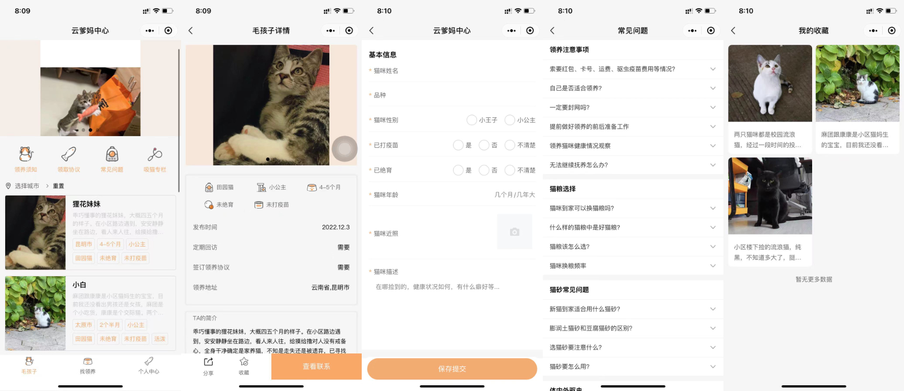

# 小狸花一家
## 前言
这是一个猫咪领养小程序。主要功能是：通过用户在线填写猫咪信息，其他用户通过搜索查找到心仪的猫咪，完善个人领养信息后，进行猫咪领养，领养前需要先查看是否符合领养要求，比如是否同城，已封窗等等；确认无误后，进行申请，确认无误后可以获得相关联系方式；

## 主要模块
  - 首页列表
    - 首页轮播
    - 根据地区查询
    - 领取协议
    - 领取须知
  - 送养表单
    - 送养须知
    - 送养信息填写
  - 个人中心
    - 我的收藏
    - 我的申请
    - 我的送养

## 技术栈
  - 微信小程序
    - 自定义组件
    - behavior
    - generic特性
    - model层封装
    - 自定义tabbar栏
    - 自定义导航栏
    - 标签、容器、卡片等业务组件
  - 微信云开发
  - less + ts（ts没怎么用）
  - vant/weapp组件库

## 注意事项
  - [引入vant注意事项](https://vant-contrib.gitee.io/vant-weapp/#/quickstart)
  - [自定义胶囊](https://www.cnblogs.com/chenwolong/p/navigationBar.html)
## TODO
  - 针对云开发数据库API回调统一封装（统一风格，确认success，fail成功回调得到处理）
  - 管理模块导出导出（别名导入等）

## 最后：`欢迎扫码体验小程序`
  
  

  